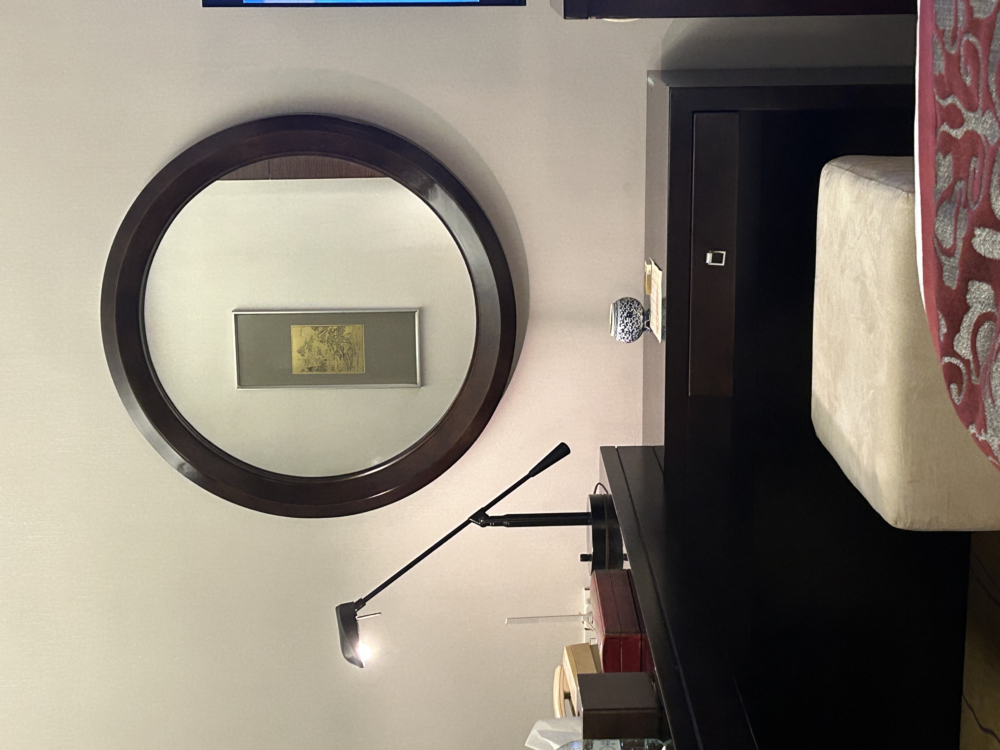
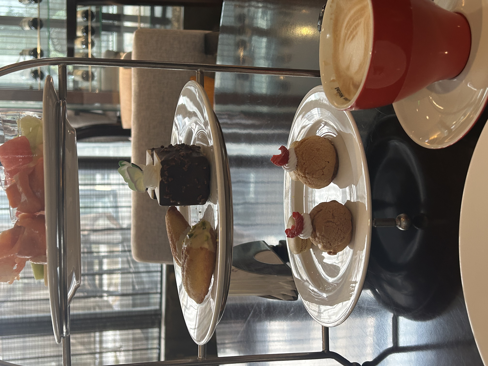

### 计划

> 路程3h，7:00起，7:30出门
> 10:30到南园宾馆，车子放那，下午茶是1:00～4:00（？不确定到那边再问一下）
> 打车去西园寺（那边外地车牌限行）
> 西园寺门票5r/人（喂猫，烧香，吃一碗素面）下午回酒店（参观+下午茶）
>
> 吃完回房间休息或者睡一会儿，3点多起来去宾馆对面有个网师园逛一下（17:00闭园）
>
> 晚上走路去十全街逛一下，顺便街上吃吃喝喝完回去睡觉
> 周日晚点起床，中午吃一顿kfc！起来先喝一杯代数学家！大润发+盒马shopping完打道回府，先去大润发，如果钱用不完再去盒马

计划的很好很轻松，体力仍然跟不上，一万多步两个人已累趴

### 西园寺

中午到的时候，感觉饿晕，急需吃一碗面条子

走起，冲素面馆，人真多，先买票后排队，

一碗观音一碗如意，感觉观音比较好吃，如意味道淡了

#### 喂猫

猫感觉都被门口毒猫条的影响了，不咋吃弗列加特，三只猫只吃完一支猫条！

奸商害人！

素包子仍然要排大长队！打道回府！

### 南园

酒店环境很好！不过特来电充电四个半小时才充满hhhh是电压低还是同桩的电车有涡轮增压黑科技？

中午歇了会喝奶茶+打游戏，约了下午讲解，酒店内有好几个民国的景点

幸运的是2.那批只有我跟nana,经理带着我俩边逛园子边讲解

#### 下午茶

酒店送了下午茶，咱们也是精致起来了

### 十全街

出门十全街吃了个闽南菜，感觉也没啥逛的，游客步行街的感觉

### 周日

查了查盒马居然不能用！只好去大润发带一兜子生活用品，最后搬东西都搬累了，真是幸福的烦恼==。。。

临了喝了个瑞幸，吃了个KFC 做午饭就上路了。。

写的跟流水账毫无区别。。。