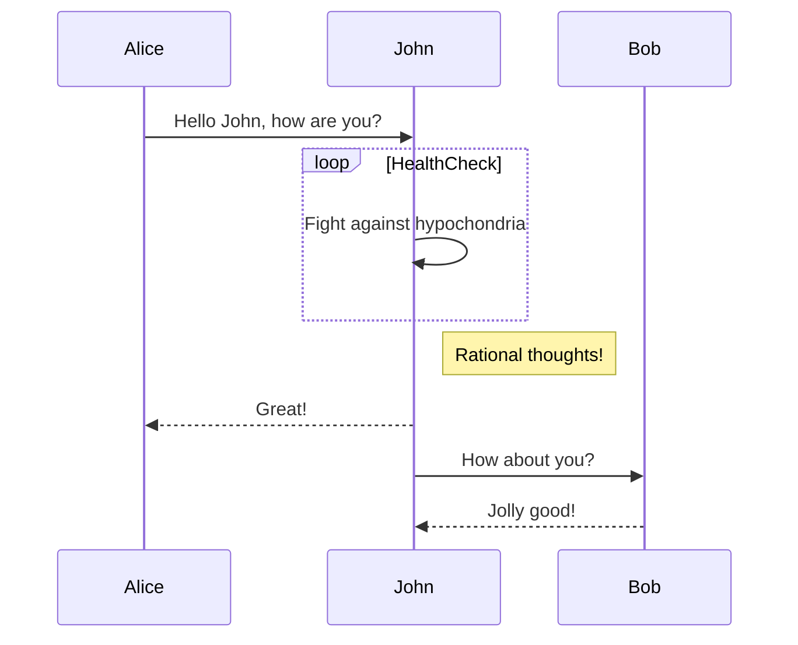

# Markdown 语法测试

## 1. 标题

### 一级标题
# 这是一级标题

### 二级标题
## 这是二级标题

### 三级标题
### 这是三级标题

## 2. 段落

这是一个普通的段落，它可以包含文本、链接、强调等。

这是另一个段落。

## 3. 强调

- **加粗文本**
- *斜体文本*
- ***加粗且斜体的文本***

## 4. 列表

### 无序列表
- 项目 1
- 项目 2
  - 子项目 1
  - 子项目 2
    - 孙项目

### 有序列表
1. 第一项
2. 第二项
3. 第三项

## 5. 链接

[Google](https://www.google.com)

[本地链接](./localfile.md)

## 6. 图片


## 7. 引用

> 这是一个引用块，通常用于引用他人说的话。

> 你可以在引用中嵌套其他 Markdown 格式。

## 8. 代码

### 行内代码
这是 `行内代码` 示例。

### 代码块
```python
def hello_world():
    print("Hello, world!")
```

### 测试Mermaid

